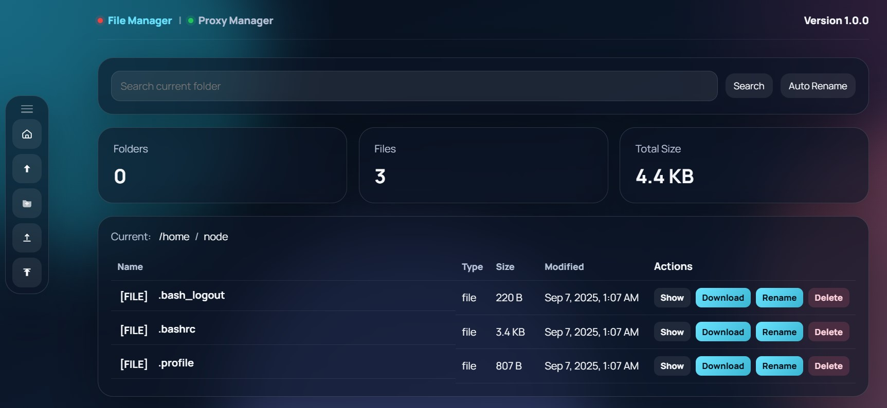
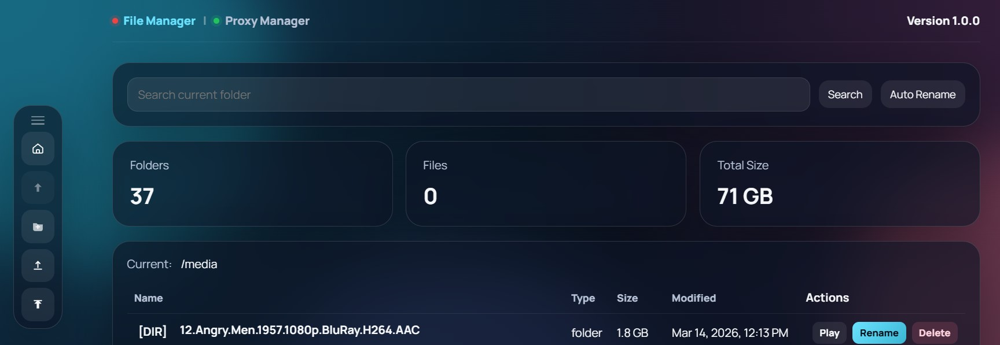
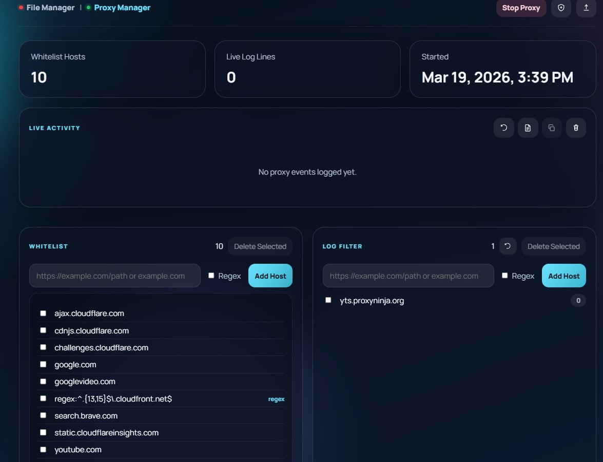

# Web File Manager for Pi

Express-based file manager and proxy control panel for a Raspberry Pi or small Linux host.

The file manager is useful, but the proxy is one of the most powerful parts of this project: you can run a local MITM proxy from the web UI, manage whitelists and log filters, inspect traffic, download the generated CA certificate, and automatically capture torrent downloads for Transmission.

## What It Does

- Start and stop a local MITM proxy from the web UI
- Manage proxy whitelist entries from the web UI or flat file
- Manage proxy log-filter entries from the web UI or flat file
- View, copy, download, and clear proxy logs
- Download the generated proxy CA certificate
- Capture torrent downloads seen by the proxy and forward them to Transmission
- Switch between a file manager page at `/` and a proxy manager page at `/proxy`
- Browse and manage files under a configurable media root
- Upload, rename, delete, download, and preview files
- Play `.mp4` files in the browser
- Show `.srt` subtitle files inline as text
- Scan for matching MP4/SRT pairs and apply guided rename suggestions
- Upload an application update zip and trigger a service restart

## Proxy Highlights

- Web UI at `/proxy` for start, stop, monitoring, and configuration
- Flat-file backed whitelist and log-filter management, with live updates for new requests
- Built-in activity log viewer with copy, download, and clear actions
- Downloadable CA certificate for devices that need to trust the proxy
- Torrent capture pipeline that can hand matching downloads to Transmission automatically

If the main reason you are running this app is traffic inspection, whitelist management, or torrent capture, the proxy page is the part to start with.

## Screenshots

### File Manager



### Player



### Proxy



## Project Structure

- [server.js](/home/user/jellyfin-file-manager/server.js): Express app entry point
- [routes/files.js](/home/user/jellyfin-file-manager/routes/files.js): file manager, media rename, root-path, and app-update API
- [routes/proxy.js](/home/user/jellyfin-file-manager/routes/proxy.js): proxy API, whitelist/log-filter management, torrent capture, and Transmission forwarding
- [public/app.jsx](/home/user/jellyfin-file-manager/public/app.jsx): frontend UI
- [public/styles.css](/home/user/jellyfin-file-manager/public/styles.css): frontend styles
- [middleware/security.js](/home/user/jellyfin-file-manager/middleware/security.js): auth and security headers
- [utils/appConfig.js](/home/user/jellyfin-file-manager/utils/appConfig.js): persisted app configuration such as the active root path
- [utils/safePath.js](/home/user/jellyfin-file-manager/utils/safePath.js): safe path validation and resolution
- [utils/uploads.js](/home/user/jellyfin-file-manager/utils/uploads.js): upload temp storage and size limits
- [proxy-whitelist.txt](/home/user/jellyfin-file-manager/proxy-whitelist.txt): proxy allowlist
- [proxy-log-filter.txt](/home/user/jellyfin-file-manager/proxy-log-filter.txt): hosts hidden from the proxy activity log
- [transmission.config.example.json](/home/user/jellyfin-file-manager/transmission.config.example.json): example Transmission connection defaults
- [.env.example](/home/user/jellyfin-file-manager/.env.example): example environment configuration

## Requirements

- Node.js 18 or newer
- npm
- Linux environment for service status and restart support
- `systemd` if you want the built-in service status and restart flow

## Install

```bash
npm install
```

Create local config files as needed:

```bash
cp .env.example .env
cp transmission.config.example.json transmission.config.json
```

## Run

```bash
npm start
```

Default app URL:

```text
http://localhost:3000
```

Main pages:

- File manager: `http://localhost:3000/`
- Proxy manager: `http://localhost:3000/proxy`

## Proxy Setup On Your PC

To actually inspect HTTPS traffic through the built-in MITM proxy, you need to do two things on the device or PC that will use it:

1. Start the proxy from `http://<server-ip>:3000/proxy`
2. Download the proxy CA certificate from the proxy page or `GET /api/proxy/ca-cert`
3. Install and trust that certificate on the PC/device/browser that will use the proxy
4. Configure that PC/device to use your server as its HTTP/HTTPS proxy

Typical proxy settings:

- Host: your Web File Manager for Pi server IP or hostname
- Port: `3001` by default

Without installing the generated certificate, HTTPS sites will fail certificate validation. Without configuring the PC to use the proxy, traffic will bypass the proxy completely and you will not see requests in the proxy logs.

## Docker

Build and run the app directly with Docker:

```bash
docker build -t web-file-manager .
docker run --name web-file-manager \
  -p 3000:3000 \
  -p 3001:3001 \
  -e APP_BIND_HOST=0.0.0.0 \
  -e FILE_MANAGER_USERNAME=admin \
  -e FILE_MANAGER_PASSWORD=change-me \
  -e FILE_MANAGER_ROOT=/media \
  -e APP_CONFIG_FILE=/data/app.config.json \
  -e PROXY_CA_DIR=/data/proxy-ca \
  -e PROXY_LOG_FILE=/data/proxy-requests.log \
  -e PROXY_WHITELIST_FILE=/data/proxy-whitelist.txt \
  -e PROXY_LOG_FILTER_FILE=/data/proxy-log-filter.txt \
  -e TORRENT_CAPTURE_DIR=/data/torrents \
  -e TRANSMISSION_CONFIG_FILE=/data/transmission.config.json \
  -v "$(pwd)/data:/data" \
  -v /mnt/storage/jellyfin/media:/media \
  --restart unless-stopped \
  web-file-manager
```

Or with Docker Compose:

```bash
docker compose up -d --build
```

Container notes:

- `docker-compose.yml` mounts `./data` for persistent app state, logs, proxy CA files, and Transmission defaults.
- Update `FILE_MANAGER_USERNAME` and `FILE_MANAGER_PASSWORD` before exposing the container on your network.
- The file-manager root is mounted from `/mnt/storage/jellyfin/media` on the host into `/media` inside the container.
- Service restart and `systemctl`-based status checks are intended for host installs and may report `offline` inside containers unless you wire in a custom `APP_UPDATE_RESTART_CMD`.

## Main Environment Variables

- `HOST` or `APP_BIND_HOST`
  Default: `127.0.0.1`

- `PORT`
  Default: `3000`

- `FILE_MANAGER_USERNAME`
  Optional. Enables HTTP Basic authentication when paired with `FILE_MANAGER_PASSWORD`.

- `FILE_MANAGER_PASSWORD`
  Optional. Enables HTTP Basic authentication when paired with `FILE_MANAGER_USERNAME`.

- `FILE_MANAGER_API_TOKEN`
  Optional API token alternative for scripted access.

- `ALLOW_UNAUTHENTICATED`
  Default: `false`
  Required if you intentionally want to run without auth on a non-loopback host.

- `FILE_MANAGER_ROOT`
  Default file root exposed by the file manager.
  Default: `/mnt/storage/jellyfin/media`

- `APP_CONFIG_FILE`
  Optional path for persisted runtime settings such as the current file-manager root.
  Default: `<project-root>/app.config.json`

- `MAX_UPLOAD_BYTES`
  Default: `1073741824` (1 GiB)

- `MAX_APP_UPDATE_BYTES`
  Default: `262144000` (250 MiB)

- `MAX_JSON_BODY_BYTES`
  Default: `1mb`

- `MAX_FORM_BODY_BYTES`
  Default: `1mb`

- `PROXY_PORT`
  Default: `3001`

- `PROXY_BIND_HOST`
  Default: `0.0.0.0`

- `PROXY_FORCE_SNI`
  Default: `false`

- `PROXY_WHITELIST_FILE`
  Default: `<project-root>/proxy-whitelist.txt`

- `PROXY_LOG_FILTER_FILE`
  Default: `<project-root>/proxy-log-filter.txt`

- `PROXY_LOG_FILE`
  Default: `<project-root>/proxy-requests.log`

- `PROXY_CA_DIR`
  Default: `<project-root>/proxy-ca`

- `PROXY_START_TIMEOUT_MS`
  Default: `15000`

- `MAX_PROXY_LOG_LINES`
  Default: `3000`

- `TORRENT_CAPTURE_DIR`
  Default: `<project-root>/torrent files`

- `MAX_TORRENT_CAPTURE_BYTES`
  Default: `10485760` (10 MiB)

- `TRANSMISSION_CONFIG_FILE`
  Default: `<project-root>/transmission.config.json`
  You can create this from `transmission.config.example.json`.

- `TRANSMISSION_RPC_URL`
  Optional override for the Transmission RPC endpoint.

- `TRANSMISSION_USERNAME`
  Optional override for the Transmission username.

- `TRANSMISSION_PASSWORD`
  Optional override for the Transmission password.

- `TRANSMISSION_DOWNLOAD_DIR`
  Optional download directory sent to Transmission for captured torrents.

- `APP_UPDATE_TARGET_DIR`
  Default: `/home/user/jellyfin-file-manager`

- `APP_UPDATE_SERVICE_NAME`
  Default: `jellyfin-file-manager`

- `APP_UPDATE_RESTART_CMD`
  Optional custom restart command. If set, it is executed with `sh -lc`.

- `APP_UPDATE_RECOVERY_WAIT_MS`
  Default: `8000`

- `APP_UPDATE_RECOVERY_POLL_MS`
  Default: `500`

## Proxy Whitelist

Edit [proxy-whitelist.txt](/home/user/jellyfin-file-manager/proxy-whitelist.txt) with one entry per line:

```txt
# One host per line
yts.proxyninja.org
challenges.cloudflare.com
regex:^(.+\.)?example\.com$
```

- Plain entries are normalized hostnames
- `regex:` entries are matched case-insensitively
- UI and file changes apply to new requests without restarting the proxy

## Proxy Log Filter

Edit [proxy-log-filter.txt](/home/user/jellyfin-file-manager/proxy-log-filter.txt) with one entry per line to hide matching hosts from the proxy activity log:

```txt
fonts.gstatic.com
www.google.com
regex:^(.+\.)?gstatic\.com$
```

Use the `Regex` checkbox in the UI to store a pattern entry. In the file, regex entries are written with a `regex:` prefix.

## Proxy Logs

The proxy writes short request events into `proxy-requests.log`.

Examples include:

- `STARTED`
- `STOPPED`
- `REQUEST`
- `HTTP`
- `BLOCKED`
- `ERROR`
- `WHITELIST`
- `LOGFILTER`
- `TORRENT`
- `TRANSMISSION`

`GET /api/proxy/logs` returns filtered recent entries for the UI.

`GET /api/proxy/logs/text` returns the raw log file contents.

## Transmission Integration

If a proxied response looks like a torrent download, the proxy can:

1. capture the `.torrent` payload into `TORRENT_CAPTURE_DIR`
2. base64-encode the file
3. submit it to Transmission with `torrent-add`

You can create `transmission.config.json` from [transmission.config.example.json](/home/user/jellyfin-file-manager/transmission.config.example.json) and provide defaults like:

```json
{
  "rpcUrl": "http://127.0.0.1:9091/transmission/rpc",
  "username": "user",
  "password": "pass",
  "downloadDir": "/path/to/downloads"
}
```

Environment variables override values from this file.

## App Update Flow

The `Version x.y.z` button on the file manager page accepts a `.zip` file and:

1. extracts it to a temporary directory
2. copies the extracted files into `APP_UPDATE_TARGET_DIR`
3. responds to the browser
4. schedules a background restart of `APP_UPDATE_SERVICE_NAME`

## Raspberry Pi systemd Example

Typical commands:

```bash
sudo systemctl restart jellyfin-file-manager
sudo systemctl status jellyfin-file-manager
journalctl -u jellyfin-file-manager -n 100 --no-pager
```

## API Summary

File routes:

- `GET /api/files`
- `GET /api/files/service-status`
- `GET /api/files/root`
- `POST /api/files/root`
- `POST /api/files/upload`
- `POST /api/files/app-update`
- `GET /api/files/download`
- `GET /api/files/show`
- `DELETE /api/files`
- `POST /api/files/folder`
- `POST /api/files/rename`
- `POST /api/files/media-rename/scan`
- `POST /api/files/media-rename/apply`

Proxy routes:

- `GET /api/proxy/status`
- `POST /api/proxy/start`
- `POST /api/proxy/stop`
- `GET /api/proxy/whitelist`
- `POST /api/proxy/whitelist`
- `PUT /api/proxy/whitelist`
- `DELETE /api/proxy/whitelist`
- `GET /api/proxy/log-filters`
- `POST /api/proxy/log-filters`
- `PUT /api/proxy/log-filters`
- `DELETE /api/proxy/log-filters`
- `POST /api/proxy/log-filters/reset-counts`
- `GET /api/proxy/logs`
- `GET /api/proxy/logs/text`
- `POST /api/proxy/clear-logs`
- `GET /api/proxy/ca-cert`
- `POST /api/proxy/refresh-whitelist`
